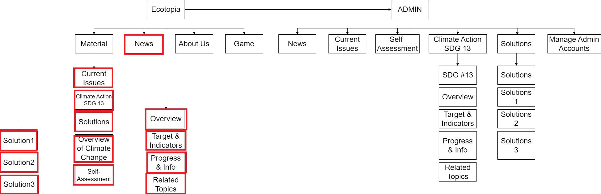
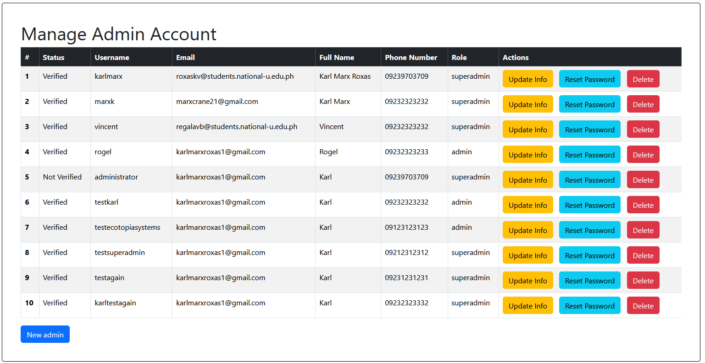

# User Manual
Here is the Sitemap of the website. A box with red indicates that you can modify its content including pictures and text but not structure

To access admin you need to go to [ecotopia.systems/login](ecotopia.systems/login)

### Table of Contents
1. [Manage Admin Accounts](#manage-admin-accounts)
2. [Manage News](#manage-news)
3. [Manage Current Issues](#manage-current-issues)
4. [Manage Assessment](#manage-assessment)
5. [Manage Climate Action SDG 13](#manage-climate-action-sdg-13)
    1. [Manage SDG #13](#manage-sdg-13)
    2. [Manage Overview](#manage-overview)
    3. [Manage Target and Indicators](#manage-target-and-indicators)
    4. [Manage Progress and Info](#manage-progress-and-info)
    5. [Manage Related Topics](#manage-related-topics)
1. [Manage Solutions](#manage-solutions)
    1. [Manage Solutions](#manage-solutions)
    2. [Manage Solutions 1](#manage-solution-1)
    3. [Manage Solutions 2](#manage-solution-2)
    4. [Manage Solutions 3](#manage-solution-3)

---

## Manage Admin Accounts
You can only Manage Admin Accounts with Super Admin Account logged in
##### Create Admin Account
Note: *You can only create admin accounts if you are logged in as super admin.*

There are two types of admin: 
    - **Super admin:** Can manage accounts and modify text and pictures
    - **Admin:** Can only modify text and pictures

To create new account, you must have a super admin access or you can contact us at *karlm.roxas@gmail.com*

Click the Color Blue New admin Button at lower left side and fill the required fields. After that, check your email to verify your account. If the account is not verified, you cannot login.

##### Update Admin Account
Note: *You can only update info of admin accounts if you are logged in as super admin.*

You can update the following:
- Username
- Email
- Full name
- Phone Number
- Role:
    - Super Admin
    - Admin
- Status: 
    - Not Verified: User cannot log in with this status
    - Verified: User can login in with this status
    - Disabled: User cannot log in with this status

To reset password click the Reset Password button and enter new password.

##### Delete Admin Account
Note: *You can only delete admin accounts if you are logged in as super admin.*

To delete an account, just simply click the Red Delete Button on the same row of account you want to delete.

## Manage News
You can manage news with both super admin and admin accounts

##### Add News

To add news, simply click the Add News button and fill the required fields.

##### Edit News

To edit the news, simply click the Edit button and modify the field you want to edit. In website, you will see a quote block of source. What you put in link will show in quote block.

##### Delete News

To delete news, simply click the delete button and confirm its deletion.

---

## Manage Current Issues

In current issues, you cannot edit the link and name of the tabs. You can only edit the area within the red box. 

To edit the text, simply click it. It is a inline-text. If you want to remove the text-area just click on the random blank space.

To ensure to save the changes, click the Publish button. If you do not Publish it, the changes will not save. 

---

## Manage Assessment
In self-assessment, it has the same idea. You click the text you want to edit, click on the random blank space to remove the text area.

To edit the correct answer, click the correct answer field and enter the correct answer. Correct answer must be the same in the selection.

The Blue box area is the question, red box area is the options or selection of answer, violet box area is the answer. To edit it, simply click it and click the Publish button to save.

Note: *Make sure that correct answer field has the same character including capitalization and spelling of the correct answer in selection or option.*

---

## Manage Climate Action SDG 13

### Manage SDG #13
Note: *In website, it represent the /problems*

The red box is the only area you can modify. You can modify the picture by browsing the picture but be mindful with the constraint indicated.

### Manage Overview
Note: *In website, it represent the /case1*

The red box is the only area you can modify

### Manage Target and Indicators
Note: *In website, it represent the /case2*

The red box is the only area you can modify

### Manage Progress and Info
Note: *In website, it represent the /case3*

The red box is the only area you can modify

### Manage Related Topics
Note: *In website, it represent the /case4*

The red box is the only area you can modify

---

# Manage Solutions

### Manage Solutions
Note: *In website, it represent the /solutions*

The red box is the only area you can modify. The image of each solutions can be changed in their respective web page. For example, if you want to change the image display in "Why we should take action" you should go to ``/admin-solution-1`` and change the picture. Same rules apply to all solutions.

### Manage Solution 1
Note: *In website, it represent the /whyshouldwetakeactions*

The red box is the only area you can modify.

### Manage Solution 2
Note: *In website, it represent the /othersolutions*

The red box is the only area you can modify.

### Manage Solution 3
Note: *In website, it represent the /respondingtoclimatechange*

The red box is the only area you can modify.

